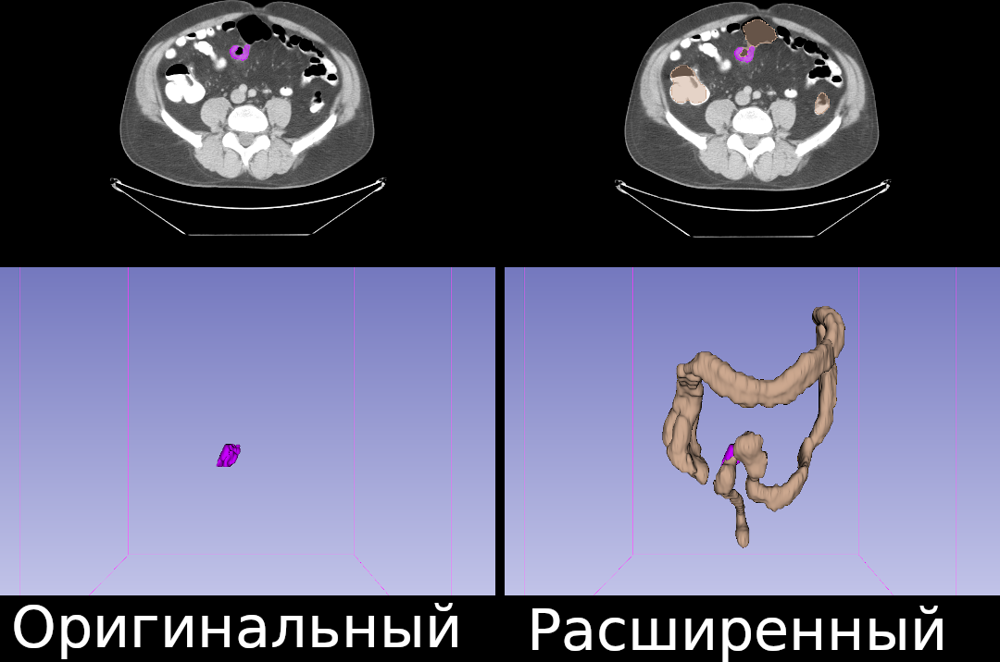
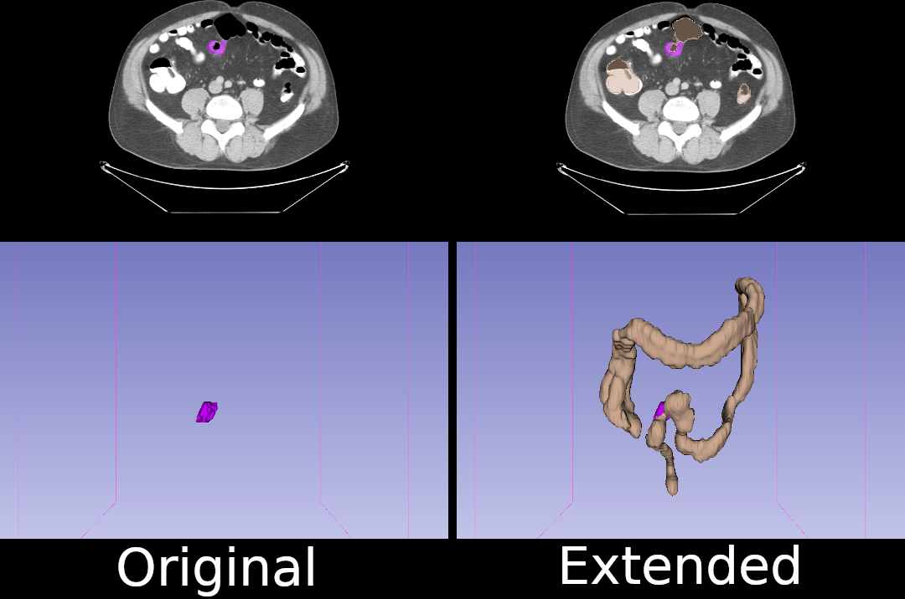

# Расширение датасета Medical Decathlon

Дополнительные разметки для Medical Decathlon. Данные доступны по [ссылке](https://disk.yandex.ru/d/z1i8y5bnX4UD1A).

Создано отделами Сеченовского университета - [1](https://www.sechenov.ru/univers/structure/institute/institut-urologii-i-reproduktivnogo-zdorovya-cheloveka/tsentr-neyrosetevykh-tekhnologiy/?sphrase_id=2282387), [2](https://www.sechenov.ru/univers/structure/institute/institut-klinicheskoy-meditsiny/kafedry-klinicheskoy-mediciny-im-Sklificovskoro/fsurg2/), [3](https://www.sechenov.ru/virtual-tour/tour/content/a/ru/1203.php).  

Были обучены нейросетвые модели архитектуры UNet с кросс-валидацией по 5 частям и достигнуто качество метрики Дайса 0,6988±0,3

Код будет выложен перед конференцией.

---

# Extended Medical Decathlon

Extended masks for Medical Decathlon. Data available [here](https://disk.yandex.ru/d/z1i8y5bnX4UD1A)

Created by the departments of Sechenov university [1](https://www.sechenov.ru/univers/structure/institute/institut-urologii-i-reproduktivnogo-zdorovya-cheloveka/tsentr-neyrosetevykh-tekhnologiy/?sphrase_id=2282387), [2](https://www.sechenov.ru/univers/structure/institute/institut-klinicheskoy-meditsiny/kafedry-klinicheskoy-mediciny-im-Sklificovskoro/fsurg2/), [3](https://www.sechenov.ru/virtual-tour/tour/content/a/ru/1203.php).  

Neural network models of the UNet architecture with cross-validation in 5 parts were trained and the quality of the Dice metric 0,6988±0,3 was achieved.

If you use it please cite our [paper].. coming soon...